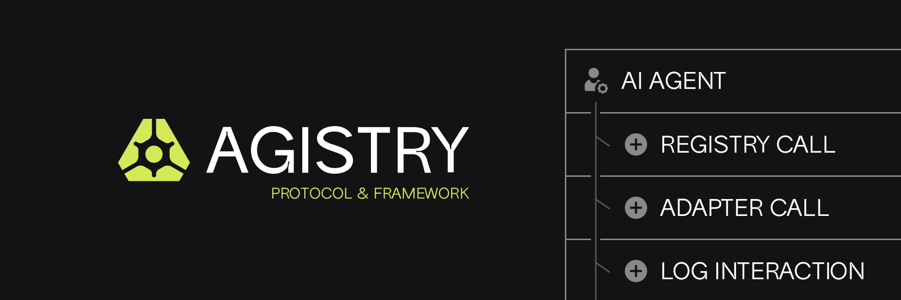
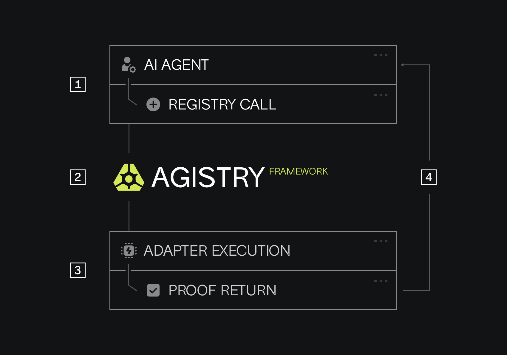

# Agistry - Decentralized Adapter Registry for AI Agents (Solana Program)



Agistry is a decentralized registry built on the Solana blockchain that allows AI agents to discover and interface with off-chain tools and APIs in a standardized and trustworthy manner. This repository contains the core Solana smart contract (program) for the Agistry registry.

**Problem Agistry Solves:**
Most AI agents in Web3 still rely on custom-built, insecure adapters to call off-chain services. This leads to:

- No standards for interfacing.
- No proofs of data integrity or execution.
- No composability between agents and tools.
- Fragile, messy, and unscalable integrations.

**Agistry's Solution:**

- A **decentralized adapter registry** where developers can publish metadata about their tools/APIs.
- **Standardizing access** to these off-chain services through a defined Adapter Interface Specification (AIS), typically using OpenAPI.
- (Future) Enabling **proofs** for verifiable off-chain interactions.
- Promoting **composability** and scalability for AI agent-tool ecosystems.



## Features of the Solana Program

- **Registry Initialization:** Securely set up the registry with an admin, initial schema version, and optional registration fees.
- **Adapter Registration:** Developers can register their adapters, providing an immutable metadata hash (e.g., IPFS CID) pointing to detailed off-chain information (like an OpenAPI spec).
- **Adapter Management:**
  - Update metadata hash for an adapter.
  - Deprecate adapters that are no longer active.
  - Transfer ownership of an adapter registration.
- **Fee Mechanism (Optional):** Configure a registration fee in SOL, payable to a designated recipient.
- **Pause Functionality:** The admin can pause new registrations or modifications during maintenance or emergencies.
- **Event-Driven:** Emits detailed events for all significant actions, enabling off-chain indexers to build rich query capabilities (e.g., find adapters by owner, tag, etc.).
- **Built with Anchor:** Leverages the Anchor framework for safer and more efficient Solana program development.

## Core Concepts

- **Registry Configuration (`RegistryConfig` PDA):** A singleton Program Derived Address (PDA) that stores global settings like the admin, current adapter counter, metadata schema version, fee details, and pause status.
- **Adapter Account (`AdapterAccount` PDA):** Each registered adapter has its own PDA, uniquely identified by an auto-incrementing ID. It stores the adapter's owner, the metadata hash, status (Active/Deprecated), timestamps, and its PDA bump.
- **Adapter Metadata:** Rich details about an adapter (name, description, OpenAPI spec URL, security requirements, tags, etc.) are stored **off-chain** (e.g., on IPFS or Arweave). The on-chain `AdapterAccount` only stores a hash (e.g., IPFS CID) pointing to this off-chain data. This keeps on-chain storage costs low.
- **Adapter Interface Specification (AIS):** (Defined externally) A specification (e.g., based on OpenAPI) that all registered adapters should adhere to for how AI agents interact with them.
- **Events:** The program emits events for actions like `AdapterRegistered`, `AdapterMetadataUpdated`, etc. These are crucial for off-chain services to build indexes and provide query capabilities that are not feasible or cost-effective to implement directly on-chain (e.g., "list all adapters owned by X").

## Program Structure (`programs/agistry_registry/src/lib.rs`)

- **`initialize_registry`:** Sets up the global `RegistryConfig` account.
- **`register_adapter`:** Creates a new `AdapterAccount` for a new adapter.
- **`update_adapter_metadata`:** Allows the owner to change the `metadata_hash` of an active adapter.
- **`deprecate_adapter`:** Allows the owner to mark an adapter as deprecated.
- **`transfer_adapter_ownership`:** Allows the owner to transfer control of an adapter registration to a new owner.
- **Admin Functions (`set_pause_status`, `set_metadata_schema_version`, etc.):** Allow the admin to manage the registry.
- **Account Structs:** Define the data structures for `RegistryConfig` and `AdapterAccount`.
- **Context Structs:** Define the accounts required for each instruction, along with their constraints (e.g., ownership checks, PDA derivations).
- **Events & Errors:** Define custom events and error types.

## Building and Deploying

This program is built using the [Anchor Framework](https://www.anchor-lang.com/).

1. **Prerequisites:**

   - Install Rust: `curl --proto '=https' --tlsv1.2 -sSf https://sh.rustup.rs | sh`
   - Install Solana CLI: Refer to [Solana documentation](https://docs.solana.com/cli/install-solana-cli-tools)
   - Install Anchor: Refer to [Anchor installation guide](https://www.anchor-lang.com/docs/installation) (e.g., `avm install latest && avm use latest`)
   - Node.js and yarn/npm for running tests.

2. **Clone the repository (if applicable):**

   ```bash
   git clone https://github.com/agistry-dev/agistry-framework-v1
   cd agistry-framework-v1
   ```

3. **Build the program:**

   ```bash
   anchor build
   ```

   After the first successful build, a program ID will be generated. Update the `declare_id!(<id>);` line in `programs/agistry_registry/src/lib.rs` with this new ID. Then, rebuild.

4. **Run Tests (Example):**
   (You'll need to write tests in the `tests/` directory, typically using TypeScript and `@coral-xyz/anchor`.)

   ```bash
   anchor test
   ```

5. **Deploy to a localnet:**

   - Start a local Solana validator: `solana-test-validator`
   - Deploy: `anchor deploy --provider.cluster localhost`

6. **Deploy to Devnet/Mainnet-Beta:**
   - Configure Solana CLI for the desired cluster:
     ```bash
     solana config set --url devnet
     # or
     solana config set --url mainnet-beta
     ```
   - Ensure your wallet has enough SOL for deployment.
   - Deploy: `anchor deploy` (it will use the currently configured cluster)

## Interacting with the Registry

Clients (like the Agistry SDK or AI agents) will interact with this deployed Solana program using RPC calls.

- **Fetching Adapter Data:** To get adapter details, clients would typically:
  1.  Query an **off-chain indexing service** (that listens to Agistry events) for adapters based on criteria (e.g., capability, owner). This service would return the `adapter_id` and the on-chain account address of the `AdapterAccount`.
  2.  Fetch the `AdapterAccount` data directly from the Solana blockchain using its address to get the `metadata_hash`.
  3.  Fetch the actual metadata (e.g., OpenAPI spec) from the decentralized storage (IPFS/Arweave) using the `metadata_hash`.
- **Transactions:** Registering, updating, or transferring adapters involves sending transactions that call the respective instructions in this program.

## Future Considerations

- **Reputation System:** Integrating mechanisms for rating or vouching for adapters.
- **On-chain Proof Verification:** Storing or verifying proofs related to adapter execution (this is complex and may involve other protocols or L2s).
- **More Granular Categorization/Tagging:** While tags can be in off-chain metadata, some core on-chain categorization might be useful if simple enough.
- **Governance:** Mechanisms for upgrading the program or changing critical parameters via a DAO.

---

This README provides a high-level overview. For detailed program logic, refer to the source code in `programs/agistry_registry/src/lib.rs`.
